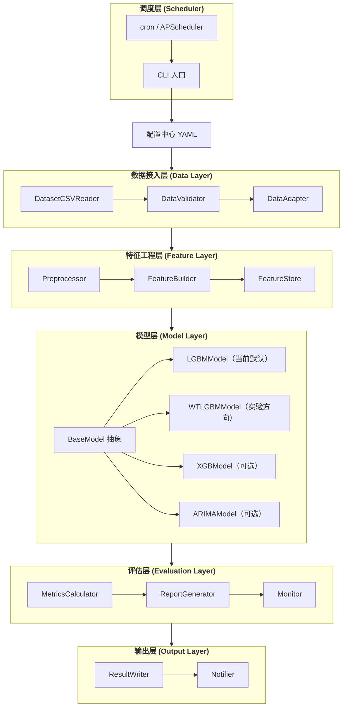

# 完整项目架构设计：基于 LightGBM 的用户侧日前出清电价预测

**版本**：v1.0
**日期**：2026-07-06
**基于原型**：`prototype/prototype_lgbm.py`，真实数据验证 MAPE ~8.5%（修正前）/ ~6.9%（LGBM）
**目标**：在原型基础上，设计可维护、可扩展、可上线的完整工程架构

---

## 一、项目背景与目标

### 1.1 原型阶段成果

原型已通过 `prototype/prototype_lgbm.py` 在真实数据集上验证：

| 指标 | 原型结果 | 完整流程结果 | 说明 |
|------|---------|-------------|------|
| MAPE | ~8.5%（修正前） | ~6.9%（LGBM）/ 待跑通 WT-LGBM | 测试集为最近 30 天（15min 粒度）；早期 4.2% 为重复行导致的数据泄露 |
| 方向准确率 | ~34-46% | ~50%（LGBM）/ 待跑通 WT-LGBM | 受时间对齐逻辑影响较大，需稳定化 |
| 特征重要性 | hour / price_lag_1d / 负荷类特征居前 | reserve_pos / renewable_penetration / reserve_neg 居前 | 验证了日期特征与滞后特征的价值 |
| 数据读取 | `DatasetCSVReader` 可正确处理宽表 | 同左 | 已解决 00:00/24:00 时间戳问题与重复行问题 |

### 1.2 完整项目目标

1. **工程化**：将单文件原型拆分为模块化项目结构。
2. **可复现**：通过配置文件管理数据路径、特征、模型参数。
3. **可扩展**：支持纯 LGBM（当前默认）、WT-LGBM（实验）、XGBoost、ARIMA 等多种模型对比。
4. **可维护**：引入数据校验、特征版本、模型监控、日志与告警。
5. **可上线**：支持每日定时运行、结果输出、模型自动重训。

---

## 二、系统总体架构

### 2.1 架构全景图



### 2.2 与原型相比的核心变化

| 维度 | 原型 | 完整项目 |
|------|------|----------|
| 代码组织 | 单文件 | 模块化：`src/data/features/models/evaluation/pipeline` |
| 模型支持 | 纯 LGBM 单模型 | 基类 + 多模型（LGBM 当前默认 / WT-LGBM 实验 / XGB / ARIMA） |
| 配置管理 | 硬编码 | YAML + dataclass |
| 数据校验 | 无 | DataValidator + 校验报告 |
| 特征管理 | 硬编码 | FeatureBuilder + FeatureStore |
| 训练流程 | 手动切分 | TrainPipeline + PredictPipeline |
| 监控告警 | 无 | Monitor：精度衰减、数据漂移 |
| 部署运行 | 手动执行 | CLI + 脚本 + 定时调度 |

---

## 三、项目目录结构

```
electricity-price-prediction-lgbm/
├── README.md                              # 项目说明
├── requirements.txt                       # Python 依赖
├── setup.py                               # 包安装脚本
├── pyproject.toml                         # 现代 Python 项目配置
├── .gitignore
├── config/
│   ├── default.yaml                       # 主配置
│   ├── features.yaml                      # 特征定义
│   ├── data_sources.yaml                  # 数据源映射
│   └── model_params.yaml                  # 模型参数模板
├── data/                                  # 运行时生成（gitignore）
│   ├── raw/                               # 原始数据备份
│   ├── processed/                         # 清洗后宽表
│   ├── features/                          # 特征矩阵 Parquet
│   └── predictions/                       # 预测结果
├── models/                                # 模型持久化（gitignore）
│   ├── lgbm/                              # 纯 LGBM 模型
│   ├── wtlgbm/                            # WT-LGBM 模型组
│   ├── xgb/                               # XGBoost 模型（可选）
│   └── scalers/                           # 归一化器
├── logs/                                  # 日志（gitignore）
├── reports/                               # 报告（gitignore）
│   ├── daily/
│   ├── weekly/
│   └── monthly/
├── src/
│   ├── __init__.py
│   ├── data/
│   │   ├── __init__.py
│   │   ├── reader.py                      # 数据读取器
│   │   ├── validator.py                   # 数据校验器
│   │   ├── adapter.py                     # 数据适配器
│   │   └── schema.py                      # 数据结构与类型
│   ├── features/
│   │   ├── __init__.py
│   │   ├── preprocessor.py                # 预处理
│   │   ├── feature_builder.py             # 特征构建
│   │   ├── feature_store.py               # 特征存储
│   │   └── feature_registry.py            # 特征注册
│   ├── models/
│   │   ├── __init__.py
│   │   ├── base.py                        # 模型抽象基类
│   │   ├── lgbm_model.py                  # 纯 LGBM
│   │   ├── wtlgbm_model.py                # WT-LGBM
│   │   ├── xgb_model.py                   # XGBoost（可选）
│   │   ├── arima_model.py                 # ARIMA 基准
│   │   └── model_factory.py               # 模型工厂
│   ├── evaluation/
│   │   ├── __init__.py
│   │   ├── metrics.py                     # 评估指标
│   │   ├── report.py                      # 报告生成
│   │   └── monitor.py                     # 监控与告警
│   ├── pipeline/
│   │   ├── __init__.py
│   │   ├── train_pipeline.py              # 训练流程
│   │   ├── predict_pipeline.py            # 预测流程
│   │   └── daily_runner.py                # 每日自动运行
│   ├── cli/
│   │   ├── __init__.py
│   │   └── main.py                        # 命令行入口
│   └── utils/
│       ├── __init__.py
│       ├── config.py                      # 配置加载
│       ├── logger.py                      # 日志
│       ├── time_utils.py                  # 时间工具
│       └── exceptions.py                  # 自定义异常
├── tests/
│   ├── test_reader.py
│   ├── test_feature_builder.py
│   ├── test_models.py
│   ├── test_metrics.py
│   └── test_pipeline.py
├── scripts/
│   ├── run_daily.sh
│   ├── run_daily.bat
│   └── retrain.sh
└── prototype/
    ├── prototype_lgbm.ipynb               # 已验证原型
    └── prototype_lgbm.py                  # 已验证原型脚本
```

---

## 四、核心模块设计

### 4.1 数据接入层（`src/data/`）

#### 4.1.1 设计原则
- 所有数据源通过 `data_sources.yaml` 配置。
- `DatasetCSVReader` 统一处理宽表转长表、时间戳解析、**重复日期去重**、**前日 24:00 映射次日 00:00**。
- 新增 `read_target()` 和 `read_features()` 高层接口。
- 保留 `MockDataReader` 用于测试。

#### 4.1.2 关键类

```python
class DatasetCSVReader(BaseDataReader):
    def read_target(self) -> pd.DataFrame
    def read_table(self, table_name: str) -> pd.DataFrame
    def read_features(self, feature_names: list[str]) -> dict[str, pd.DataFrame]

class DataValidator:
    def validate_all(self, target: pd.DataFrame, features: dict) -> ValidationReport

class DataAdapter:
    def build_panel(self, features: dict, target: pd.DataFrame) -> pd.DataFrame
```

### 4.2 特征工程层（`src/features/`）

#### 4.2.1 设计原则
- `FeatureBuilder` 按配置从 `features.yaml` 生成特征。
- 所有构造特征通过公式描述，便于审计。
- `FeatureStore` 将特征矩阵保存为 Parquet + JSON 元数据。
- 严格防泄露：滞后特征只能用 T-1 及之前的数据。

#### 4.2.2 特征分类（与原型一致）

| 类别 | 特征数 | 示例 |
|------|--------|------|
| 直接特征 | 10 | sys_load_pred, wind_power_pred, solar_power_pred, ... |
| 构造特征 | 7 | net_load, renewable_penetration, import_ratio, ... |
| 滞后特征 | 6 | price_lag_1d, price_lag_7d, actual_load_lag_1d, ... |
| 日期特征 | 11 | hour, weekday, month, is_peak, hour_sin, ... |
| **合计** | **~34** | 后续通过特征重要性筛选 |

### 4.3 模型层（`src/models/`）

#### 4.3.1 抽象基类

```python
class BaseModel(ABC):
    @abstractmethod
    def fit(self, X_train, y_train, X_valid=None, y_valid=None) -> dict
    @abstractmethod
    def predict(self, X) -> np.ndarray
    @abstractmethod
    def save(self, path: str)
    @abstractmethod
    def load(self, path: str) -> "BaseModel"
    def get_feature_importance(self) -> pd.DataFrame
```

#### 4.3.2 模型实现

| 模型 | 文件 | 说明 |
|------|------|------|
| **LGBMModel** | `lgbm_model.py` | **当前默认模型**：纯 LightGBM，继承基类，稳定可用 |
| WTLGBMModel | `wtlgbm_model.py` | 平稳小波变换（SWT）+ 多 LGBM；已实现但精度异常，待调优后切换为主模型 |
| XGBModel | `xgb_model.py` | 可选基准模型 |
| ARIMAModel | `arima_model.py` | 简单时序基准 |

#### 4.3.3 模型工厂

```python
class ModelFactory:
    @staticmethod
    def create(model_type: str, config: dict) -> BaseModel:
        if model_type == "wtlgbm":
            return WTLGBMModel(config)
        elif model_type == "lgbm":
            return LGBMModel(config)
        elif model_type == "xgb":
            return XGBModel(config)
        elif model_type == "arima":
            return ARIMAModel(config)
        else:
            raise ValueError(f"Unknown model type: {model_type}")
```

### 4.4 评估层（`src/evaluation/`）

#### 4.4.1 评估指标
- MAE、RMSE、MAPE、sMAPE、R²
- 方向准确率
- 尖峰命中率 / 误报率 / 漏报率
- 分时段 MAPE（峰/平/谷）

#### 4.4.2 报告生成
- 日报：预测曲线、精度指标、TOP10 特征重要性
- 周报：趋势图、残差分析
- 月报：模型稳定性、漂移检测

#### 4.4.3 监控告警
- 连续 N 天 MAPE 超过阈值 → 告警
- 方向准确率连续下降 → 告警
- 数据漂移 PSI > 0.25 → 触发重训练

### 4.5 流程编排层（`src/pipeline/`）

#### 4.5.1 训练流程

```python
class TrainPipeline:
    def run(self) -> dict:
        # 1. 加载配置
        # 2. 读取目标与特征
        # 3. 数据校验
        # 4. 特征工程
        # 5. 时序分割
        # 6. 模型训练（含可选 Optuna 调参）
        # 7. 评估
        # 8. 保存模型与报告
```

#### 4.5.2 预测流程

```python
class PredictPipeline:
    def run(self, target_date: str) -> pd.DataFrame:
        # 1. 加载最新模型
        # 2. 读取目标日期的事前数据
        # 3. 构建特征（含滞后特征，严格防泄露）
        # 4. 模型推理
        # 5. 输出结果
```

#### 4.5.3 每日运行器

```python
class DailyRunner:
    def run(self):
        # 预测当日电价
        # 可选：对比昨日实际值，更新监控指标
        # 触发重训练条件满足时自动重训练
```

### 4.6 命令行入口（`src/cli/main.py`）

```bash
# 训练
python -m src.cli.main --config config/default.yaml train

# 预测
python -m src.cli.main --config config/default.yaml predict --date 2026-07-02

# 评估
python -m src.cli.main --config config/default.yaml evaluate --start 2026-06-01 --end 2026-06-30

# 重训练
python -m src.cli.main --config config/default.yaml retrain

# 运行日报
python -m src.cli.main --config config/default.yaml daily
```

---

## 五、配置管理

### 5.1 `config/default.yaml`

```yaml
data:
  reader_type: "dataset_csv"
  dataset_root: "./Dataset"
  granularity: "15min"
  sources:
    target_price: "用户侧日前出清发布/用户侧日前出清发布_统一结算点电价最终结果.csv"
    sys_load_pred: "短期系统负荷预测/短期系统负荷预测信息_出清发布电力.csv"
    # ... 其他数据源

preprocessing:
  fill_00_with_24: true
  solar_wind_night_fill: 0.0
  missing_strategy: "ffill"
  outlier_method: "iqr"
  outlier_threshold: 3.0
  normalize_method: "none"

features:
  lag_windows: [1, 7]
  rolling_windows: [96, 672]
  use_price_lags: true
  use_actual_lags: true
  use_date_features: true

model:
  # 主模型类型：wtlgbm | lgbm | xgb | arima
  # 当前 WT-LGBM 实现处于实验阶段，默认使用 lgbm 保证可用性
  type: "lgbm"
  wavelet: "db4"
  decompose_level: 2
  window_size: 30

  train:
    test_days: 30
    early_stopping_rounds: 50
    num_boost_round: 5000
    cross_validation: true
    cv_folds: 5

  predict:
    horizon: 96

  lgbm_params:
    objective: "regression"
    metric: "rmse"
    learning_rate: 0.05
    num_leaves: 63
    max_depth: 12
    min_data_in_leaf: 20
    feature_fraction: 0.8
    bagging_fraction: 0.8
    lambda_l1: 0.01
    lambda_l2: 0.01

optuna:
  enabled: false
  n_trials: 50
  cv_folds: 3

evaluation:
  spike_threshold_sigma: 2.0
  alert_thresholds:
    mape: 20
    direction_accuracy: 55

output:
  prediction_dir: "./data/predictions"
  report_dir: "./reports"
  model_dir: "./models"
  log_dir: "./logs"
```

### 5.2 配置加载

```python
@dataclass
class AppConfig:
    data: DataConfig
    preprocessing: PreprocessingConfig
    features: FeatureConfig
    model: ModelConfig
    optuna: OptunaConfig
    evaluation: EvaluationConfig
    output: OutputConfig
```

---

## 六、模型训练与调参策略

### 6.1 默认模型选择

当前默认使用 **纯 LGBM**。原因：
1. 纯 LGBM 已能在真实数据上达到约 6.9% 的 MAPE，作为基线稳定可用。
2. WT-LGBM 已实现 SWT 分解与多分量训练，但初步测试精度异常（MAPE ~105%），需进一步调优分量目标构造、正则化与高频分量处理策略。
3. 纯 LGBM 训练快、可解释性强、工程维护成本低，适合作为默认生产模型；WT-LGBM 作为实验方向，跑通后将切换为主模型。

### 6.2 调参策略

| 阶段 | 目标 | 方法 |
|------|------|------|
| 第一阶段 | 确定基线 | 纯 LGBM 默认参数跑通完整流程 |
| 第二阶段 | 主模型基线 | WT-LGBM 默认参数跑通完整流程 |
| 第三阶段 | 粗调 | Optuna，搜索 num_leaves/max_depth/learning_rate |
| 第四阶段 | 细调 | 正则化与采样参数 |
| 第五阶段 | 稳健性 | 尝试 Huber/Quantile 损失 |

### 6.3 防止过拟合

- 时序分割：不打乱顺序。
- 特征采样：`feature_fraction=0.8`。
- 样本采样：`bagging_fraction=0.8`。
- 早停：`early_stopping_rounds=50`。
- 正则化：`lambda_l1`、`lambda_l2`。

---

## 七、数据流与防泄露

### 7.1 训练时数据流

```
Dataset/ CSV
    ↓
DatasetCSVReader (宽表 → 长表；前日 24:00 映射次日 00:00；重复日期去重)
    ↓
DataValidator (缺失、对齐、重复)
    ↓
DataAdapter (多表合并，目标对齐)
    ↓
Preprocessor (缺失填补、异常处理、归一化)
    ↓
FeatureBuilder
    ├── 直接特征（ contemporaneous，预测时可用）
    ├── 构造特征（ contemporaneous）
    ├── 滞后特征（T-1 及之前，防泄露）
    └── 日期特征
    ↓
时序分割（最近 30 天测试集）
    ↓
LGBMModel（默认） / WTLGBMModel（实验）
    ↓
MetricsCalculator + ReportGenerator
```

### 7.2 预测时数据流

```
目标日期的事前数据
    ↓
历史数据（用于滞后特征，最多到 T-1）
    ↓
构建特征矩阵
    ↓
加载已训练模型
    ↓
预测目标日期 96 点电价
    ↓
输出 CSV / 数据库
```

### 7.3 防泄露清单

| 风险点 | 防控措施 |
|--------|----------|
| 滞后特征越界 | `shift(points_per_day * n)`，只使用历史值 |
| 滚动统计包含未来 | `shift(1)` 后再 rolling |
| 验证集数据参与训练 | 时序分割，scaler 只在训练集 fit |
| 目标变量提前泄露 | 构造特征不使用 contemporaneous 的目标 |

---

## 八、评估与监控

### 8.1 离线评估

每次训练后输出：
- 测试集 MAE/RMSE/MAPE/R²
- 方向准确率
- 尖峰命中率
- 分时段 MAPE
- 特征重要性 TOP10
- 预测 vs 实际曲线图

### 8.2 在线监控

每日运行后：
- 对比预测值与次日实际出清价。
- 更新滚动 7 天/30 天指标。
- 触发告警条件时通知相关人员。

### 8.3 模型重训触发条件

- 连续 3 天 MAPE > 15%
- 连续 5 天方向准确率 < 60%
- PSI > 0.25
- 手动触发

---

## 九、部署与运行

### 9.1 本地开发

```bash
pip install -r requirements.txt
python -m src.cli.main train --model lgbm
python -m src.cli.main predict --date 2026-07-02
```

### 9.2 定时调度

Linux：
```bash
# crontab -e
0 8 * * * /path/to/scripts/run_daily.sh
```

Windows：
```batch
# 任务计划程序调用 scripts/run_daily.bat
```

### 9.3 CI/CD 建议

- GitHub Actions 运行 `pytest tests/`
- 提交 PR 时检查代码格式（black、isort）
- 训练流水线在服务器手动触发或定时触发

---

## 十、开发计划

| 阶段 | 任务 | 产出 |
|------|------|------|
| Phase 1 | 完善数据层与特征层 | `reader.py`、`validator.py`、`feature_builder.py` 稳定可用 |
| Phase 2 | 抽象模型层 | `BaseModel`、`LGBMModel`、`ModelFactory` |
| Phase 3 | 完善流程编排 | `TrainPipeline`、`PredictPipeline`、`DailyRunner` |
| Phase 4 | 评估与监控 | `ReportGenerator`、`Monitor`、告警机制 |
| Phase 5 | CLI 与部署 | `src/cli/main.py`、运维脚本、定时调度 |
| Phase 6 | 多模型对比 | LGBM vs WT-LGBM vs XGBoost 精度对比报告 |

---

## 十一、关键修正记录

1. **00:00/24:00 时间戳语义修正**：`DatasetCSVReader` 不再用同天 `24:00` 回填 `00:00`，而是让**前日 `24:00` 映射到次日 `00:00`**，并对重复日期行和重复时间戳去重保留非空值。这修复了原先因重复行导致的数据泄露和合并膨胀问题。
2. **WT-LGBM 对齐修正**：使用 **SWT（平稳小波变换）** 替代 DWT 进行分量分解，确保低频/高频分量长度与特征矩阵一致，可直接用于 LGBM 训练。
3. **主模型选择修正**：WT-LGBM 已实现 SWT 分解，但初步精度异常，暂以纯 LGBM 为默认生产模型，WT-LGBM 作为实验方向持续调优。

## 十三、待决策事项

1. **WT-LGBM 精度是否已优于纯 LGBM？** 当前 WT-LGBM 初步测试 MAPE 异常，需调优分量目标与高频处理；在此之前默认模型保持为纯 LGBM。
2. **是否引入 XGBoost/ARIMA 基准？** 建议引入，便于横向评估。
3. **预测结果输出到哪里？** 当前默认 CSV，后续可扩展数据库/API。
4. **是否需要模型 A/B 测试？** 上线稳定后建议引入。
5. **是否使用 MLflow/Wandb 实验追踪？** 团队规模扩大后建议引入。

## 十四、附录：原型到完整项目的映射

| 原型文件 | 完整项目对应 | 说明 |
|----------|-------------|------|
| `prototype/prototype_lgbm.py` | `src/pipeline/train_pipeline.py` + `src/models/lgbm_model.py` + `src/models/wtlgbm_model.py` | 单文件拆分为模块；LGBM 当前默认，WT-LGBM 实验方向 |
| `load_wide_table()` | `src/data/reader.py` | 工程化读取器，含去重与 24:00 映射 |
| 特征工程代码 | `src/features/feature_builder.py` | 可配置化 |
| 评估函数 | `src/evaluation/metrics.py` | 指标计算器 |
| 可视化 | `src/evaluation/report.py` | 报告生成器 |
| 硬编码参数 | `config/*.yaml` | 配置驱动 |
