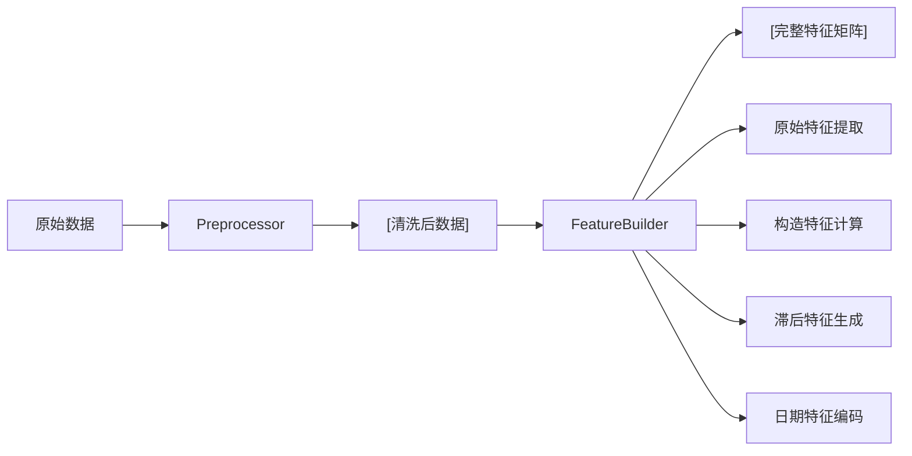
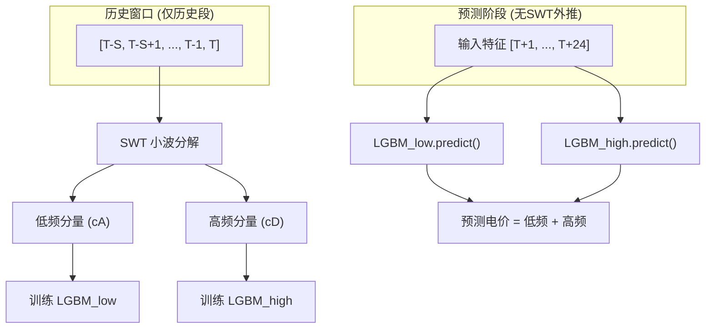
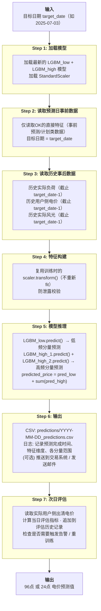
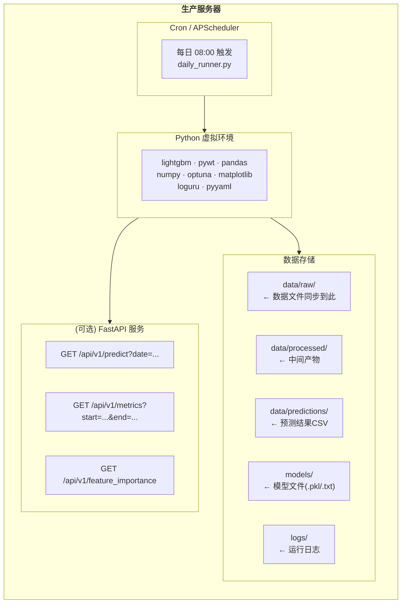

# 详细设计方案：用户侧日前出清电价预测（WT-LGBM）

**版本**：v2.0
**日期**：2026-07-06
**基于需求文档**：v2.0
**基于数据集**：`Dataset/` 目录下 48 个 CSV，2026-01-01 ~ 2026-07-01，15 分钟粒度

---

## 一、系统总体架构

### 1.1 架构全景图

```mermaid
flowchart TB
    subgraph scheduler["<b>调度层 (Scheduler)</b>"]
        trigger["每日定时触发 / 手动触发 / API触发"]
    end

    scheduler --> data_layer

    subgraph data_layer["<b>数据接入层 (Data Layer)</b>"]
        dr["<b>DatasetCSVReader</b><br/>读取 Dataset/ 下 CSV 宽表<br/>元数据剥离 · 宽表转长表"]
        dv["<b>DataValidator</b><br/>数据质量校验<br/>完整性检查 · 异常值标记 · 时效性检查 · 重复日期检查"]
        da["<b>DataAdapter</b><br/>格式标准化<br/>00:00回填 · 时间对齐 · 缺失值标记"]
    end

    data_layer --> feature_layer

    subgraph feature_layer["<b>特征工程层 (Feature Layer)</b>"]
        pp["<b>Preprocessor</b><br/>缺失值填补 · 异常值处理<br/>归一化/标准化 · 时间特征编码"]
        fb["<b>FeatureBuilder</b><br/>原始特征提取 · 构造特征计算<br/>滞后特征生成 · 滚动统计特征"]
        fs["<b>FeatureStore</b><br/>特征版本管理<br/>特征元数据记录 · 特征重要性追踪"]
    end

    feature_layer --> model_layer

    subgraph model_layer["<b>模型层 (Model Layer)</b>"]
        wd["<b>WaveletDecomposer</b><br/>SWT小波分解 · 分量重构<br/>防泄露窗口管理 · 逆变换"]
        lt["<b>LightGBMTrainer</b><br/>低频分量模型 · 高频分量模型<br/>超参数优化 · 交叉验证"]
        pr["<b>Predictor</b><br/>分量预测 · 预测值合成<br/>置信区间估计 · 异常预警"]
    end

    model_layer --> eval_layer

    subgraph eval_layer["<b>评估层 (Evaluation Layer)</b>"]
        mc["<b>MetricsCalculator</b><br/>MAE/RMSE/MAPE · 方向准确率<br/>尖峰命中率 · 分时段评估"]
        rg["<b>ReportGenerator</b><br/>日报/周报/月报 · 特征重要性报告<br/>可视化图表 · CSV/Excel导出"]
        mo["<b>Monitor</b><br/>预测vs实际对比 · 精度衰减预警<br/>数据漂移检测 · 模型重训触发"]
    end

    eval_layer --> output_layer

    subgraph output_layer["<b>输出层 (Output Layer)</b>"]
        rw["<b>ResultWriter</b><br/>预测结果CSV写入<br/>数据库写入 · 文件归档管理"]
        no["<b>Notifier</b><br/>邮件通知<br/>企业微信/钉钉 · 异常告警"]
        api["<b>APIService</b><br/>RESTful API<br/>交易系统对接 · 历史查询接口"]
    end
```



### 1.2 技术栈

| 层次 | 技术选型 | 选型理由 |
|------|----------|----------|
| 核心框架 | Python 3.9+ | 生态完善，数据处理和ML库丰富 |
| 数据处理 | pandas, numpy | 时序数据的标准工具链 |
| 小波变换 | PyWavelets (pywt) | 最成熟的Python小波库 |
| 模型训练 | LightGBM (lightgbm) | 需求指定，训练快、可解释性强 |
| 超参优化 | Optuna | 比GridSearch效率高，支持剪枝 |
| 特征存储 | Parquet + JSON元数据 | 列存高效，元数据可追溯 |
| 任务调度 | APScheduler 或 cron | 轻量级，无需Airflow等重型框架 |
| 可视化 | matplotlib + seaborn | 评估报告和特征分析 |
| 配置管理 | YAML + dataclass | 可读性强，类型安全 |
| 日志 | Python logging + loguru | 结构化日志，便于排查 |
| API服务(可选) | FastAPI | 轻量高性能，自动文档 |

---

## 二、项目目录结构

```
electricity_price_prediction/
├── README.md                          # 项目说明
├── requirements.txt                   # Python依赖
├── setup.py                           # 包安装脚本
├── config/
│   ├── default.yaml                   # 默认配置（所有可调参数）
│   ├── model_params.yaml              # LightGBM超参数
│   ├── features.yaml                  # 特征定义与分组
│   └── data_sources.yaml              # 数据源连接配置（上线后使用）
├── data/                              # 数据目录（gitignore）
│   ├── raw/                           # 原始数据
│   ├── processed/                     # 清洗后数据
│   ├── features/                      # 特征矩阵存储
│   └── predictions/                   # 预测结果输出
├── models/                            # 模型持久化
│   ├── lgb_low/                       # 低频分量模型
│   ├── lgb_high/                      # 高频分量模型（可能多个）
│   └── scalers/                       # 归一化器
├── logs/                              # 运行日志
├── reports/                           # 评估报告输出
│   ├── daily/
│   ├── weekly/
│   └── monthly/
├── src/
│   ├── __init__.py
│   ├── data/                          # 数据接入模块
│   │   ├── __init__.py
│   │   ├── reader.py                  # DataReader：多源数据读取
│   │   ├── validator.py               # DataValidator：数据质量校验
│   │   ├── adapter.py                 # DataAdapter：格式与粒度标准化
│   │   └── schema.py                  # 数据表字段定义（dataclass）
│   ├── features/                      # 特征工程模块
│   │   ├── __init__.py
│   │   ├── preprocessor.py            # 缺失值、异常值、归一化
│   │   ├── feature_builder.py         # 原始+构造特征提取
│   │   ├── lag_features.py            # 滞后特征与时序窗口特征
│   │   ├── date_features.py           # 日期/时间特征编码
│   │   └── feature_registry.py        # 特征注册与版本管理
│   ├── models/                        # 模型模块
│   │   ├── __init__.py
│   │   ├── wavelet.py                 # 小波分解/重构/逆变换
│   │   ├── lgbm_trainer.py            # LightGBM训练器
│   │   ├── optimizer.py               # Optuna超参数优化
│   │   ├── predictor.py               # 推理预测
│   │   └── baseline.py                # 基准模型（ARIMA/XGB/LSTM）
│   ├── evaluation/                    # 评估模块
│   │   ├── __init__.py
│   │   ├── metrics.py                 # 所有评估指标计算
│   │   ├── report.py                  # 报告生成（文本+图表）
│   │   └── monitor.py                 # 运行监控与告警
│   ├── pipeline/                      # 流程编排模块
│   │   ├── __init__.py
│   │   ├── train_pipeline.py          # 训练流程
│   │   ├── predict_pipeline.py        # 预测流程
│   │   └── daily_runner.py            # 每日自动运行主脚本
│   └── utils/                         # 工具模块
│       ├── __init__.py
│       ├── config.py                  # 配置加载与校验
│       ├── logger.py                  # 日志配置
│       ├── time_utils.py              # 时间处理工具（时段对齐、节假日等）
│       └── exceptions.py              # 自定义异常类
├── notebooks/                         # Jupyter探索笔记（开发阶段）
│   ├── 01_data_exploration.ipynb
│   ├── 02_feature_analysis.ipynb
│   ├── 03_baseline_comparison.ipynb
│   └── 04_model_interpretation.ipynb
├── tests/                             # 单元测试
│   ├── test_preprocessor.py
│   ├── test_feature_builder.py
│   ├── test_wavelet.py
│   ├── test_lgbm_trainer.py
│   └── test_metrics.py
└── scripts/                           # 运维脚本
    ├── run_daily.sh                   # Linux每日运行
    ├── run_daily.bat                  # Windows每日运行
    └── retrain.sh                     # 手动重训练
```

---

## 三、核心模块详细设计

### 3.1 数据接入模块 (`src/data/`)

#### 3.1.1 设计原则

数据集已到位，数据接入模块采用 **"真实数据驱动 + 配置化路径"** 的设计策略：
- 所有数据源路径统一在 `config/data_sources.yaml` 中配置
- `DatasetCSVReader` 专门处理 `Dataset/` 下 CSV 宽表（前 9 列元数据 + 96 列时点）
- 保留 `MockDataReader` 作为 fallback，用于单元测试和无数据环境
- 定义统一的数据 Schema（dataclass），所有下游模块只依赖 Schema，不依赖具体数据源

#### 3.1.2 数据文件约定

实际数据文件位于 `Dataset/` 目录，格式统一为：

| 位置 | 列名 | 说明 |
|------|------|------|
| 前 9 列 | ID、父ID、数据类型、数据地区、数据所属菜单、数据来源、数据描述、日期、更新时间 | 元数据列 |
| 后 96 列 | 00:00、00:15、...、23:45、24:00 | 15 分钟时点列 |

读取时需：
1. 以 `日期` 列作为日期维度
2. 将 `00:00`~`24:00` melt 为长表，生成 `datetime`（日期 + 时点）
3. **对重复日期行去重（保留最后一条），并对重复时间戳去重保留非空值**
4. **将前日 `24:00` 映射为次日 `00:00`，不再用同天 `24:00` 回填同天 `00:00`**
5. 返回标准 `TimeSeriesRecord` 序列或 `DataFrame[timestamp, value, field_name]`

#### 3.1.3 数据Schema设计 (`schema.py`)

```python
from dataclasses import dataclass, field
from datetime import datetime
from enum import Enum
from typing import Optional
import numpy as np

class Granularity(Enum):
    """数据时间粒度"""
    MIN15 = 15    # 15分钟/点，每天96点
    HOUR1 = 60    # 1小时/点，每天24点

class DataSource(Enum):
    """数据来源类型"""
    PRE_DAY_AHEAD = "pre_day_ahead"    # 事前预测/计划类
    POST_ACTUAL = "post_actual"        # 事后实际值
    POST_CLEARING = "post_clearing"    # 事后出清结果

@dataclass
class TimeSeriesRecord:
    """单条时序记录的基础结构"""
    timestamp: datetime          # 时间戳
    point_index: int             # 时段序号 (0-95 或 0-23)
    value: float                 # 数值
    source: DataSource           # 数据来源
    table_name: str              # 来源表名
    field_name: str              # 字段名

@dataclass
class FeatureMatrix:
    """特征矩阵 — 所有上下游模块的标准数据结构"""
    data: np.ndarray             # shape: (n_samples, n_features)
    timestamps: np.ndarray       # shape: (n_samples,) 每个样本的时间戳
    feature_names: list          # 特征名列表，长度 = n_features
    target: Optional[np.ndarray] # shape: (n_samples,) 训练时有，预测时为None
    target_name: str = "user_price"

@dataclass
class PredictionOutput:
    """预测结果标准结构"""
    timestamps: np.ndarray       # 预测时段
    predicted: np.ndarray        # 预测电价
    actual: Optional[np.ndarray] # 实际值（评估时有）
    low_freq: Optional[np.ndarray]   # 低频分量预测值
    high_freq: Optional[np.ndarray]  # 高频分量预测值
    confidence_lower: Optional[np.ndarray]  # 置信下界
    confidence_upper: Optional[np.ndarray]  # 置信上界
```

#### 3.1.3 数据读取器设计 (`reader.py`)

采用策略模式，定义抽象基类，不同数据源实现不同子类：

```python
from abc import ABC, abstractmethod

class BaseDataReader(ABC):
    """数据读取器抽象基类"""

    @abstractmethod
    def read_table(self, table_name: str, start_date: str, end_date: str) -> pd.DataFrame:
        """读取单张数据表"""
        pass

    @abstractmethod
    def list_available_tables(self) -> list[str]:
        """列出所有可用表"""
        pass

    @abstractmethod
    def get_date_range(self, table_name: str) -> tuple[str, str]:
        """获取某张表的数据日期范围"""
        pass

class DatasetCSVReader(BaseDataReader):
    """Dataset/ 目录 CSV 读取器：处理宽表格式（96 时点）"""

    META_COLS = [
        "ID", "父ID", "数据类型", "数据地区", "数据所属菜单",
        "数据来源", "数据描述", "日期", "更新时间",
    ]

    def __init__(self, dataset_root: str, data_sources: dict):
        self.dataset_root = Path(dataset_root)
        self.data_sources = data_sources

    def read_table(
        self,
        table_name: str,
        start_date: str = None,
        end_date: str = None,
        fill_00_with_24: bool = True,
    ) -> pd.DataFrame:
        """
        读取单张宽表并转换为长表。
        返回 DataFrame 列：timestamp, value, field_name
        """
        path = Path(self.dataset_root) / self.data_sources[table_name]
        df = pd.read_csv(path, parse_dates=["日期"])

        # 同一日期可能出现多行，保留最后一条
        df = df.drop_duplicates(subset=["日期"], keep="last")

        # 元数据列 + 时点列分离
        time_cols = [c for c in df.columns if c not in self.META_COLS]

        # melt 成长表
        df_long = df.melt(
            id_vars=["日期"], value_vars=time_cols,
            var_name="time_str", value_name="value",
        )

        # 处理 24:00 为次日 00:00；同天 00:00 保留原值
        df_long["base_date"] = df_long["日期"].dt.strftime("%Y-%m-%d")
        next_day_mask = df_long["time_str"] == "24:00"
        df_long.loc[next_day_mask, "time_str"] = "00:00"
        df_long.loc[next_day_mask, "base_date"] = (
            pd.to_datetime(df_long.loc[next_day_mask, "base_date"]) + pd.Timedelta(days=1)
        ).dt.strftime("%Y-%m-%d")
        df_long["timestamp"] = pd.to_datetime(df_long["base_date"] + " " + df_long["time_str"])
        df_long = df_long[["timestamp", "value"]].sort_values("timestamp").reset_index(drop=True)
        df_long["field_name"] = table_name

        # 去重：同一时刻若存在多条记录，保留非空值
        df_long = df_long.sort_values("value", na_position="last")
        df_long = df_long.drop_duplicates(subset=["timestamp"], keep="last")
        df_long = df_long.sort_values("timestamp").reset_index(drop=True)

        if start_date is not None:
            df_long = df_long[df_long["timestamp"] >= pd.to_datetime(start_date)]
        if end_date is not None:
            df_long = df_long[df_long["timestamp"] <= pd.to_datetime(end_date)]
        return df_long


    def list_available_tables(self) -> list[str]:
        return list(self.data_sources.keys())

    def get_date_range(self, table_name: str) -> tuple[str, str]:
        df = self.read_table(table_name)
        return df["timestamp"].min().isoformat(), df["timestamp"].max().isoformat()

class MockDataReader(BaseDataReader):
    """Mock读取器：用于开发阶段，基于历史统计生成模拟数据"""
    # 无数据环境或单元测试时使用
    pass

class DatabaseReader(BaseDataReader):
    """数据库读取器：从MySQL/PostgreSQL读取（上线后扩展）"""
    pass

class ApiDataReader(BaseDataReader):
    """API读取器：通过HTTP API获取数据（上线后扩展）"""
    pass
```

#### 3.1.4 数据校验器设计 (`validator.py`)

```python
@dataclass
class ValidationReport:
    """数据质量校验报告"""
    table_name: str
    total_rows: int
    missing_rate: dict       # {字段名: 缺失率}
    outlier_count: dict      # {字段名: 异常值数量}
    time_continuity: dict    # {日期: 缺失时段列表}
    duplicate_dates: int     # 重复日期数量
    granularity: Granularity
    is_passed: bool          # 是否通过基础校验
    warnings: list[str]      # 警告信息列表

class DataValidator:
    """数据质量校验器"""

    def check_completeness(self, df: pd.DataFrame) -> dict:
        """检查缺失率"""
        pass

    def check_outliers(self, df: pd.DataFrame, method: str = "iqr") -> dict:
        """IQR异常值检测"""
        pass

    def check_time_continuity(self, df: pd.DataFrame, expected_granularity: Granularity) -> dict:
        """检查时间连续性（是否缺时段）"""
        pass

    def check_duplicate_dates(self, df: pd.DataFrame) -> int:
        """检查日期重复（针对根目录可再生能源等文件）"""
        pass

    def check_alignment(self, df_target: pd.DataFrame, df_feature: pd.DataFrame) -> dict:
        """检查特征表与目标表的日期对齐情况"""
        pass

    def validate(self, table_name: str, df: pd.DataFrame) -> ValidationReport:
        """执行全部校验，返回报告"""
        pass
```

### 3.2 特征工程模块 (`src/features/`)

#### 3.2.1 总体流程



#### 3.2.2 预处理 (`preprocessor.py`)

```python
class Preprocessor:
    """数据预处理器"""

    def __init__(self, config: dict):
        self.missing_strategy = config.get("missing_strategy", "ffill")  # ffill | linear | mean
        self.outlier_method = config.get("outlier_method", "iqr")
        self.outlier_threshold = config.get("outlier_threshold", 3.0)    # IQR倍数
        self.normalize_method = config.get("normalize_method", "none")  # standard | minmax | none
        self.scaler = None  # 训练时fit，预测时复用

    def handle_missing(self, df: pd.DataFrame) -> pd.DataFrame:
        """
        缺失值处理策略（按优先级与数据类型）：
        1. 风光夜间空值：按物理意义填充 0
        2. 短时缺失：前向填充（ffill）
        3. 中间段缺失：线性插值（linear）
        4. 长时间缺失：均值填充（fallback）
        5. 缺失率过高字段（如出清电力 > 40%）：标记为不可用
        """
        pass

    def handle_outliers(self, df: pd.DataFrame) -> pd.DataFrame:
        """
        异常值处理：
        1. IQR方法标记：Q1 - k*IQR ~ Q3 + k*IQR 之外的值
        2. 电价尖峰（如 1251.20）为现货真实行情，默认不截断，仅记录
        3. 对非电价的极端技术异常值执行：截断（clip）而非删除（保留时序完整性）
        4. 记录异常值日志，供后续分析
        """
        pass

    def normalize(self, df: pd.DataFrame, fit: bool = True) -> pd.DataFrame:
        """
        归一化：StandardScaler 或 MinMaxScaler
        - fit=True：训练模式，fit + transform
        - fit=False：推理模式，仅transform（复用训练时的scaler）
        """
        pass

    def align_timestamps(self, dfs: dict[str, pd.DataFrame]) -> pd.DataFrame:
        """
        多表时序对齐：
        - 当前数据统一为 15min 粒度，无需转换
        - 以目标变量（统一结算点电价）的时间戳为基准
        - 对缺失日期的特征表，采用前向填充或标记为缺失
        - 返回按 timestamp 对齐的宽表
        """
        pass
```

#### 3.2.3 特征构建器 (`feature_builder.py`)

```python
class FeatureBuilder:
    """特征构建器：将原始数据转换为模型可用特征矩阵"""

    def __init__(self, feature_config: dict, feature_registry: "FeatureRegistry"):
        self.config = feature_config
        self.registry = feature_registry  # 追踪哪些特征可用

    def build_all(self, data: dict[str, pd.DataFrame]) -> FeatureMatrix:
        """构建全部特征，入口方法"""
        direct = self._build_direct_features(data)
        constructed = self._build_constructed_features(data)
        lag = self._build_lag_features(data)        # 需要历史数据
        date = self._build_date_features(data)
        # 合并 & 返回FeatureMatrix
        pass

    def _build_direct_features(self, data) -> pd.DataFrame:
        """提取可直接使用的原始特征（基于实际 Dataset/ 文件）"""
        direct_features = {
            # 事前预测/计划类（预测时可用）
            "sys_load_pred":      "短期系统负荷预测",
            "wind_power_pred":    "统调风电功率预测（地区汇总）",
            "solar_power_pred":   "统调光电功率预测（地区汇总）",
            "power_import_plan":  "受电计划（华东）",
            "coal_gen_plan":      "煤电发电计划（地区汇总）",
            "gas_gen_plan":       "燃机固定出力总值（地区汇总）",
            "storage_plan":       "储能发电计划（地区汇总）",
            "reserve_pos":        "正备用空间",
            "reserve_neg":        "负备用空间",
            # 事后实际类（仅滞后特征使用，不直接入模未来值）
            # "actual_sys_load":  "实际系统负荷",
            # "actual_wind_solar":"实际统调风光情况",
            # 辅助
            "renewable_capacity": "分省可再生能源发电能力预测",
        }
        # 仅提取 registry 中标记为 OK 的特征
        pass

    def _build_constructed_features(self, data) -> pd.DataFrame:
        """计算构造特征"""
        constructed = pd.DataFrame()
        # 竞价空间 = (负荷预测 + 受电计划) - 煤电 - 燃机 - 储能 - 风电 - 光电
        constructed["bidding_space"] = (
            data["sys_load_pred"]
            + data["power_import_plan"]
            - data["coal_gen_plan"]
            - data["gas_gen_plan"]
            - data["storage_plan"]
            - data["wind_power_pred"]
            - data["solar_power_pred"]
        )
        # 净负荷 = 负荷预测 - 新能源预测出力
        constructed["net_load"] = (
            data["sys_load_pred"]
            - data["wind_power_pred"]
            - data["solar_power_pred"]
        )
        # 外来电占比 = 受电计划 / 负荷预测
        constructed["import_ratio"] = data["power_import_plan"] / data["sys_load_pred"]
        # 备用裕度 = 正备用空间 / 负荷预测
        constructed["reserve_margin"] = data["reserve_pos"] / data["sys_load_pred"]
        # 新能源渗透率 = 新能源预测出力 / 负荷预测
        constructed["renewable_penetration"] = (
            (data["wind_power_pred"] + data["solar_power_pred"])
            / data["sys_load_pred"]
        )
        # 火电占比 = (煤电 + 燃机) / 负荷预测
        constructed["thermal_ratio"] = (
            (data["coal_gen_plan"] + data["gas_gen_plan"])
            / data["sys_load_pred"]
        )
        # 日前/实际负荷偏差（滞后 1 天构造）
        constructed["load_forecast_error"] = (
            data["actual_sys_load_lag_1d"] - data["sys_load_pred"]
        )
        return constructed

    def _build_lag_features(self, data, target_series: pd.Series = None) -> pd.DataFrame:
        """构建滞后特征（历史电价、历史实际值）
        注意：仅使用 T-1 及之前的数据，严格防止数据泄露
        """
        # 实现见 3.2.4
        pass

    def _build_date_features(self, timestamps) -> pd.DataFrame:
        """日期特征编码"""
        # 实现见 3.2.5
        pass
```

#### 3.2.4 滞后特征与防泄露设计 (`lag_features.py`)

**这是整个特征工程中最重要的模块**，需严格保证：预测 T+1 时刻时，只能使用 T 及之前的信息。

```python
class LagFeatureBuilder:
    """滞后特征构建器（带防泄露机制）"""

    def __init__(self, max_lag_days: int = 30):
        self.max_lag_days = max_lag_days

    def build_price_lags(self, price_history: pd.Series) -> pd.DataFrame:
        """
        电价滞后特征（从历史事后数据构造）：
        - lag_1d:   昨日同时段电价（96 点滞后）
        - lag_7d:   上周同日同时段（672 点滞后）
        - ma_1d:    过去 1 天移动均值（96 点窗口）
        - std_1d:   过去 1 天移动标准差（波动率）
        """
        pass

    def build_actual_lags(self, data: dict) -> pd.DataFrame:
        """
        实际值滞后特征（仅使用历史值，不包含未来信息）：
        - actual_sys_load_lag_1d:   昨日同时段实际负荷
        - actual_wind_solar_lag_1d: 昨日同时段实际风光出力（光伏 + 风力地区汇总）
        """
        pass

    def anti_leakage_check(self, feature_time: datetime, data_used: dict) -> bool:
        """
        防泄露校验核心方法：
        对每个特征时间点，验证其所用的所有数据时间戳 <= feature_time
        若违反，抛出 DataLeakageException，阻止训练继续
        """
        pass
```

**防泄露设计要点**：

| 场景 | 风险 | 措施 |
|------|------|------|
| 预测D+1日12:00电价 | 不小心用到D+1日12:00的实际负荷 | 代码层硬限制：特征时间必须 < 目标时间 |
| 滚动窗口构建滞后特征 | shift操作越界，用到了未来值 | 所有shift操作使用`pandas.shift(periods=+)`，正数=滞后 |
| 小波分解 | 边界效应波及未来 | 仅对历史段做分解，预测段用滑动窗口外推 |
| 归一化 | fit时用了测试集数据 | scaler仅在训练集上fit，测试集/预测时复用 |

#### 3.2.5 日期特征编码 (`date_features.py`)

```python
class DateFeatureBuilder:
    """日期/时间特征编码"""

    def build(self, timestamps: pd.DatetimeIndex) -> pd.DataFrame:
        features = pd.DataFrame(index=timestamps)
        features["hour"] = timestamps.hour              # 0-23
        features["minute"] = timestamps.minute          # 0/15/30/45（如果是15min粒度）
        features["weekday"] = timestamps.weekday        # 0(Mon)-6(Sun)
        features["month"] = timestamps.month            # 1-12
        features["day_of_year"] = timestamps.dayofyear  # 1-366（捕获季节性）
        features["is_weekend"] = (timestamps.weekday >= 5).astype(int)
        features["is_holiday"] = self._check_holiday(timestamps)
        # 时段分类（江苏峰谷时段，待确认具体定义）
        features["period_type"] = self._classify_period(timestamps)
        # 小时的正弦/余弦编码（保留循环性质）
        features["hour_sin"] = np.sin(2 * np.pi * timestamps.hour / 24)
        features["hour_cos"] = np.cos(2 * np.pi * timestamps.hour / 24)
        return features

    def _check_holiday(self, timestamps) -> np.ndarray:
        """基于中国法定节假日日历判定"""
        # 可使用 chinese_calendar 库
        pass

    def _classify_period(self, timestamps) -> np.ndarray:
        """峰/平/谷时段分类（江苏用户侧日前出清常见峰段：08-11、17-21）"""
        # 0→谷, 1→平, 2→峰
        hour = timestamps.hour
        is_peak = ((hour >= 8) & (hour < 11)) | ((hour >= 17) & (hour < 21))
        is_valley = (hour >= 0) & (hour < 6)
        return np.where(is_peak, 2, np.where(is_valley, 0, 1))
```

#### 3.2.6 特征注册中心 (`feature_registry.py`)

用于追踪哪些特征可用（已OK / 待确认）、特征版本和重要性：

```python
class FeatureRegistry:
    """特征注册中心：管理特征的全生命周期"""

    def __init__(self):
        self.features: dict[str, FeatureMeta] = {}

    def register(self, name: str, category: str, status: str, description: str):
        """注册一个特征"""
        pass

    def get_available_features(self) -> list[str]:
        """获取status=OK的特征列表"""
        pass

    def update_importance(self, name: str, importance: float):
        """更新特征重要性（训练后）"""
        pass

    def snapshot(self) -> dict:
        """保存当前特征状态（用于版本追踪）"""
        pass

@dataclass
class FeatureMeta:
    name: str           # 特征名
    category: str       # direct | constructed | lag | date
    status: str         # OK | PENDING | DROPPED
    description: str
    importance: float = 0.0
    version: int = 1
```

### 3.3 模型模块 (`src/models/`)

#### 3.3.1 小波分解模块 (`wavelet.py`)

本项目 WT-LGBM 使用 **SWT（Stationary Wavelet Transform，平稳小波变换）** 而非 DWT。SWT 不对系数进行下采样，因此分解得到的低频/高频分量长度与原始信号完全一致，可直接作为 LGBM 的目标变量，避免 DWT 下采样导致的长度对齐问题。

```python
import pywt
import numpy as np

class WaveletDecomposer:
    """小波分解/重构：WT-LGBM 的核心前置模块"""

    def __init__(self, wavelet: str = "db4", level: int = 2):
        """
        Args:
            wavelet: 小波基函数，默认 Daubechies 4
            level: 分解层数，2-3层
        """
        self.wavelet = wavelet
        self.level = level

    def stationary_decompose(self, signal: np.ndarray) -> dict[str, np.ndarray]:
        """
        使用 SWT 分解目标序列。

        Args:
            signal: 一维时序信号，shape = (n,)

        Returns:
            {"low": cA_L,        # 最底层低频分量（趋势）
             "high_1": cD_L,     # 第1层高频
             "high_2": cD_{L-1}, # 第2层高频
             ...}
        """
        coeffs = pywt.swt(signal, self.wavelet, level=self.level, trim_approx=True)
        # coeffs 格式：[(cA_L, cD_L), (cA_{L-1}, cD_{L-1}), ..., (cA_1, cD_1)]
        result = {"low": coeffs[0][0]}
        for i, (ca, cd) in enumerate(coeffs, start=1):
            result[f"high_{i}"] = cd
        return result

    def stationary_reconstruct(self, components: dict[str, np.ndarray]) -> np.ndarray:
        """从 SWT 分量重构原始信号。"""
        coeffs = []
        for i in range(self.level, 0, -1):
            if i == self.level:
                ca = components["low"]
            else:
                ca = np.zeros_like(components["low"])
            cd = components[f"high_{self.level - i + 1}"]
            coeffs.append((ca, cd))
        return pywt.iswt(coeffs, self.wavelet)
```

**小波分解的边界处理**（防泄露关键）：



小波分解只在历史窗口上进行，各分量的预测由LGBM完成，不涉及DWT的外推。

#### 3.3.2 LightGBM训练器 (`lgbm_trainer.py`)

WT-LGBM 为每个小波分量训练一个独立的 `LGBMTrainer`。由于 SWT 输出长度与输入信号一致，训练时无需额外对齐操作。

```python
import lightgbm as lgb

class LGBMTrainer:
    """LightGBM训练器：管理单个LGBM模型的完整生命周期"""

    def __init__(self, params: dict, component_name: str):
        """
        Args:
            params: LightGBM超参数字典
            component_name: "low" 或 "high_N"，用于日志和模型存储
        """
        self.params = {
            "objective": "regression",
            "metric": "rmse",
            "boosting_type": "gbdt",
            "learning_rate": params.get("learning_rate", 0.05),
            "num_leaves": params.get("num_leaves", 63),
            "max_depth": params.get("max_depth", 12),
            "min_data_in_leaf": params.get("min_data_in_leaf", 20),
            "feature_fraction": params.get("feature_fraction", 0.8),
            "bagging_fraction": params.get("bagging_fraction", 0.8),
            "bagging_freq": params.get("bagging_freq", 5),
            "lambda_l1": params.get("lambda_l1", 0.01),
            "lambda_l2": params.get("lambda_l2", 0.01),
            "num_threads": params.get("num_threads", -1),
            "verbosity": -1,
        }
        self.component_name = component_name
        self.model: lgb.Booster = None
        self.feature_names: list = None

    def train(
        self,
        X_train: np.ndarray,
        y_train: np.ndarray,
        X_valid: np.ndarray,
        y_valid: np.ndarray,
        feature_names: list,
        early_stopping_rounds: int = 50,
        num_boost_round: int = 5000,
    ) -> dict:
        """
        训练模型

        Returns:
            {"model": Booster, "best_iteration": int, "best_score": float, "evals_result": dict}
        """
        self.feature_names = feature_names
        train_data = lgb.Dataset(X_train, label=y_train, feature_name=feature_names)
        valid_data = lgb.Dataset(X_valid, label=y_valid, feature_name=feature_names,
                                  reference=train_data)

        callbacks = [
            lgb.early_stopping(early_stopping_rounds, verbose=False),
            lgb.log_evaluation(period=100),
        ]

        self.model = lgb.train(
            params=self.params,
            train_set=train_data,
            valid_sets=[valid_data],
            valid_names=["valid"],
            num_boost_round=num_boost_round,
            callbacks=callbacks,
        )
        return {
            "best_iteration": self.model.best_iteration,
            "best_score": self.model.best_score["valid"]["rmse"],
        }

    def predict(self, X: np.ndarray) -> np.ndarray:
        """推理"""
        if self.model is None:
            raise ModelNotTrainedError(f"Component '{self.component_name}' not trained")
        return self.model.predict(X)

    def get_feature_importance(self, importance_type: str = "gain") -> pd.DataFrame:
        """获取特征重要性"""
        importance = self.model.feature_importance(importance_type=importance_type)
        return pd.DataFrame({
            "feature": self.feature_names,
            "importance": importance,
        }).sort_values("importance", ascending=False)

    def save(self, path: str):
        """保存模型"""
        import joblib
        joblib.dump({
            "model": self.model,
            "feature_names": self.feature_names,
            "params": self.params,
            "component_name": self.component_name,
        }, path)

    @classmethod
    def load(cls, path: str) -> "LGBMTrainer":
        """加载模型"""
        import joblib
        data = joblib.load(path)
        trainer = cls(data["params"], data["component_name"])
        trainer.model = data["model"]
        trainer.feature_names = data["feature_names"]
        return trainer
```

#### 3.3.3 超参数优化 (`optimizer.py`)

```python
import optuna

class OptunaOptimizer:
    """Optuna超参数优化器"""

    def __init__(self, n_trials: int = 100, cv_folds: int = 5):
        self.n_trials = n_trials
        self.cv_folds = cv_folds
        self.study: optuna.Study = None

    def optimize(self, X, y, feature_names) -> dict:
        """执行超参数搜索，返回最优参数"""

        def objective(trial: optuna.Trial) -> float:
            params = {
                "learning_rate": trial.suggest_float("learning_rate", 0.01, 0.3, log=True),
                "num_leaves": trial.suggest_int("num_leaves", 15, 255),
                "max_depth": trial.suggest_int("max_depth", 5, 20),
                "min_data_in_leaf": trial.suggest_int("min_data_in_leaf", 10, 100),
                "feature_fraction": trial.suggest_float("feature_fraction", 0.5, 1.0),
                "bagging_fraction": trial.suggest_float("bagging_fraction", 0.5, 1.0),
                "lambda_l1": trial.suggest_float("lambda_l1", 1e-8, 10.0, log=True),
                "lambda_l2": trial.suggest_float("lambda_l2", 1e-8, 10.0, log=True),
            }
            # 时序交叉验证（不打乱）
            scores = self._time_series_cv(X, y, params, self.cv_folds)
            return np.mean(scores)

        self.study = optuna.create_study(direction="minimize")
        self.study.optimize(objective, n_trials=self.n_trials)
        return self.study.best_params

    def _time_series_cv(self, X, y, params, folds):
        """时序交叉验证：按时间顺序切分，不打乱"""
        scores = []
        fold_size = len(X) // (folds + 1)
        for i in range(folds):
            train_end = fold_size * (i + 1)
            valid_end = fold_size * (i + 2)
            X_tr, y_tr = X[:train_end], y[:train_end]
            X_val, y_val = X[train_end:valid_end], y[train_end:valid_end]
            model = lgb.train(params, lgb.Dataset(X_tr, label=y_tr),
                              valid_sets=[lgb.Dataset(X_val, label=y_val)])
            pred = model.predict(X_val)
            scores.append(np.sqrt(np.mean((pred - y_val) ** 2)))
        return scores
```

#### 3.3.4 预测器 (`predictor.py`)

整合小波分解和LGBM的完整预测流程：

```python
class WTLGBMPredictor:
    """WT-LGBM预测器：完整预测流程的编排器"""

    def __init__(self, config: dict):
        self.wavelet = WaveletDecomposer(
            wavelet=config.get("wavelet", "db4"),
            level=config.get("decompose_level", 2),
        )
        self.lgbm_params = config.get("lgbm_params", {})
        self.trainers: dict[str, LGBMTrainer] = {}

    def train(self, feature_matrix: FeatureMatrix) -> dict:
        """
        完整训练流程：
        1. 对目标序列执行 SWT，得到等长的低频 + 高频分量
        2. 对每个分量独立训练 LGBM
        """
        components = self.wavelet.stationary_decompose(feature_matrix.target)
        results = {}
        for key, target in components.items():
            trainer = LGBMTrainer(self.lgbm_params, key)
            results[key] = trainer.train(
                feature_matrix.data, target,
                feature_matrix.feature_names,
            )
            self.trainers[key] = trainer
        return results

    def predict(self, X_new: np.ndarray) -> PredictionOutput:
        """
        预测流程：
        1. 各 LGBM 分量模型分别预测
        2. 分量求和 → 最终电价预测
        """
        pred = np.zeros(len(X_new))
        low, high = None, None
        for key, trainer in self.trainers.items():
            component_pred = trainer.predict(X_new)
            pred += component_pred
            if key == "low":
                low = component_pred
            elif key.startswith("high"):
                if high is None:
                    high = component_pred
                else:
                    high += component_pred
        return PredictionOutput(
            predicted=pred,
            low_freq=low,
            high_freq=high,
        )
```

### 3.4 评估模块 (`src/evaluation/`)

#### 3.4.1 指标计算 (`metrics.py`)

```python
class MetricsCalculator:
    """评估指标计算器"""

    @staticmethod
    def mae(y_true, y_pred) -> float:
        return np.mean(np.abs(y_true - y_pred))

    @staticmethod
    def rmse(y_true, y_pred) -> float:
        return np.sqrt(np.mean((y_true - y_pred) ** 2))

    @staticmethod
    def mape(y_true, y_pred, epsilon: float = 1e-8) -> float:
        """MAPE，对零值加epsilon保护避免除零"""
        mask = np.abs(y_true) > epsilon
        return np.mean(np.abs((y_true[mask] - y_pred[mask]) / (y_true[mask] + epsilon))) * 100

    @staticmethod
    def smape(y_true, y_pred) -> float:
        """sMAPE：对零值更稳健的对称MAPE"""
        return np.mean(2 * np.abs(y_true - y_pred) / (np.abs(y_true) + np.abs(y_pred) + 1e-8)) * 100

    @staticmethod
    def direction_accuracy(y_true, y_pred) -> float:
        """
        方向准确率：预测涨跌与实际涨跌一致的比例
        比较相邻时段：sign(y_pred[t] - y_true[t-1]) == sign(y_true[t] - y_true[t-1])
        """
        actual_dir = np.sign(np.diff(y_true))
        pred_dir = np.sign(np.diff(y_pred))
        return np.mean(actual_dir == pred_dir) * 100

    @staticmethod
    def spike_capture_rate(y_true, y_pred, threshold_sigma: float = 2.0) -> dict:
        """
        尖峰电价捕捉率
        - 尖峰定义：价格 > mean(y_true) + threshold_sigma * std(y_true)
        - 返回：命中率、误报率、漏报率
        """
        threshold = np.mean(y_true) + threshold_sigma * np.std(y_true)
        true_spikes = y_true > threshold
        pred_spikes = y_pred > threshold

        tp = np.sum(true_spikes & pred_spikes)
        fp = np.sum(~true_spikes & pred_spikes)
        fn = np.sum(true_spikes & ~pred_spikes)

        return {
            "spike_capture_rate": tp / (tp + fn) if (tp + fn) > 0 else 1.0,
            "spike_false_alarm": fp / (fp + tp) if (fp + tp) > 0 else 0.0,
            "spike_miss_rate": fn / (tp + fn) if (tp + fn) > 0 else 0.0,
        }

    @staticmethod
    def period_mape(y_true, y_pred, timestamps, period_map: callable) -> dict:
        """分时段MAPE（峰/平/谷）"""
        periods = period_map(timestamps)
        results = {}
        for period_name in np.unique(periods):
            mask = periods == period_name
            results[period_name] = MetricsCalculator.mape(y_true[mask], y_pred[mask])
        return results

    def compute_all(self, y_true, y_pred, timestamps=None) -> dict:
        """一键计算所有指标"""
        return {
            "MAE": self.mae(y_true, y_pred),
            "RMSE": self.rmse(y_true, y_pred),
            "MAPE": self.mape(y_true, y_pred),
            "sMAPE": self.smape(y_true, y_pred),
            "R2": 1 - np.sum((y_true - y_pred) ** 2) / np.sum((y_true - np.mean(y_true)) ** 2),
            "direction_accuracy": self.direction_accuracy(y_true, y_pred),
            "spike_metrics": self.spike_capture_rate(y_true, y_pred),
        }
```

#### 3.4.2 报告生成 (`report.py`)

```python
class ReportGenerator:
    """报告生成器：日报 / 周报 / 月报"""

    def generate_daily(self, date: str, predictions: PredictionOutput, actuals: np.ndarray) -> str:
        """每日预测精度简报"""
        pass

    def generate_monthly(self, month: str, history: pd.DataFrame) -> str:
        """
        月度模型评估报告：
        - 各指标趋势图（MAE/RMSE/MAPE 逐日变化）
        - 预测值 vs 实际值散点图
        - 分时段精度对比
        - 方向准确率趋势
        - TOP10特征重要性
        - 异常日标注与复盘
        """
        pass

    def plot_prediction_vs_actual(self, y_true, y_pred, timestamps, save_path: str):
        """预测vs实际对比图（日曲线）"""
        pass

    def plot_feature_importance(self, importance_df: pd.DataFrame, top_n: int, save_path: str):
        """特征重要性柱状图"""
        pass

    def plot_residual_analysis(self, y_true, y_pred, save_path: str):
        """残差分析图（残差分布 + Q-Q图）"""
        pass
```

#### 3.4.3 监控与告警 (`monitor.py`)

```python
class ModelMonitor:
    """模型运行监控器"""

    def __init__(self, alert_thresholds: dict):
        self.thresholds = alert_thresholds  # {"mape": 20, "direction_acc": 55}

    def check_prediction_quality(self, y_true, y_pred) -> list[str]:
        """检查预测质量是否低于阈值，触发告警"""
        alerts = []
        metrics = MetricsCalculator().compute_all(y_true, y_pred)
        if metrics["MAPE"] > self.thresholds.get("mape", 20):
            alerts.append(f"MAPE {metrics['MAPE']:.1f}% exceeds threshold")
        if metrics["direction_accuracy"] < self.thresholds.get("direction_acc", 55):
            alerts.append(f"Direction Accuracy {metrics['direction_accuracy']:.1f}% below threshold")
        return alerts

    def detect_data_drift(self, recent_features: np.ndarray, reference_features: np.ndarray) -> float:
        """
        数据漂移检测：
        比较近期特征分布与参考（训练期）分布的差异
        使用 PSI (Population Stability Index) 或 KL散度
        """
        pass

    def should_retrain(self, recent_metrics: dict) -> bool:
        """
        判断是否需要触发重训练：
        - 连续N天MAPE超过阈值
        - 方向准确率连续下降
        """
        pass
```

### 3.5 流程编排模块 (`src/pipeline/`)

#### 3.5.1 训练流程 (`train_pipeline.py`)

```python
class TrainPipeline:
    """完整训练流程"""

    def __init__(self, config_path: str = "config/default.yaml"):
        # 加载配置并初始化 reader/validator/adapter/preprocessor/feature_builder/model
        pass

    def run(self) -> dict:
        """
        训练流程步骤：
        1. 数据读取（Dataset/ 下全部可用表）
        2. 数据质量校验 → 生成校验报告（含对齐检查）
        3. 数据预处理（清洗、24:00映射、对齐、归一化）
        4. 特征构建（原始 + 构造 + 滞后 + 日期）
        5. 时序分割（最近30天为验证集，之前为训练集）
        6. SWT 小波分解 + 各分量 LGBM 训练（含可选 Optuna 超参数优化）
        7. 模型评估 → 生成评估报告
        8. 模型保存
        """
        pass
```

### 5.2 每日预测流程 (`predict_pipeline.py`)

新增每日预测流程，负责加载已训练 WT-LGBM 模型，构建目标日期特征并输出 96 点预测。

```python
class PredictPipeline:
    """每日预测流程"""

    def __init__(self, config_path: str = "config/default.yaml"):
        pass

    def run(self, target_date: str, model_path: Optional[str] = None) -> pd.DataFrame:
        """
        预测流程：
        1. 加载最新 WT-LGBM 模型
        2. 读取目标日期的事前数据与历史事后数据
        3. 构建特征（含滞后特征，严格防泄露）
        4. 模型推理 → 低频 + 高频分量 → 合成电价
        5. 输出 96 点 CSV
        """
        pass
```

#### 3.5.3 每日自动运行器 (`daily_runner.py`)

```python
class DailyRunner:
    """每日自动运行器"""

    def __init__(self, config: dict):
        self.config = config
        self.predictor = WTLGBMPredictor.load(config["model_path"])

    def run(self, target_date: str) -> PredictionOutput:
        """
        每日运行流程：
        1. 调用 PredictPipeline 生成预测
        2. （次日）读取实际出清值 → 更新评估指标
        3. 检查是否需要触发告警 / 重训练

        执行时间要求：< 30分钟
        """
        pass
```

---

## 四、配置管理

### 4.1 主配置文件 (`config/default.yaml`)

```yaml
# ============================================================
# 用户侧日前出清电价预测 - 主配置文件
# ============================================================

# --- 数据配置 ---
data:
  # 数据时间粒度: "15min" (96点/天) 或 "1h" (24点/天)
  granularity: "15min"
  # 数据读取器类型: "dataset_csv" | "mock" | "database" | "api"
  reader_type: "dataset_csv"
  # 数据源（reader_type=dataset_csv 时生效）
  dataset_root: "./Dataset"
  sources:
    # 目标变量
    target_price: "用户侧日前出清发布/用户侧日前出清发布_统一结算点电价最终结果.csv"
    # 事前预测/计划类特征
    sys_load_pred: "短期系统负荷预测/短期系统负荷预测信息_出清发布电力.csv"
    wind_power_pred: "统调风电功率预测/统调风电功率预测_风力_地区汇总_出清发布电力.csv"
    solar_power_pred: "统调光电功率预测/统调光电功率预测_太阳能_地区汇总_出清发布电力.csv"
    power_import_plan: "受电计划/受电计划_华东_出清发布电力.csv"
    coal_gen_plan: "煤电发电计划/煤电发电计划_地区汇总_终发布电力.csv"
    gas_gen_plan: "燃机固定出力总值/燃机固定出力总值_地区汇总_出清发布电力.csv"
    storage_plan: "储能发电计划/储能发电计划_地区汇总_终发布电力.csv"
    reserve_pos: "正负备用空间/正负备用空间_正备用.csv"
    reserve_neg: "正负备用空间/正负备用空间_负备用.csv"
    # 事后实际类（用于滞后特征）
    actual_sys_load: "实际系统负荷/实际系统负荷_实际发布电力.csv"
    actual_wind_solar: "实际统调风光情况"
    renewable_capacity: "分省可再生能源发电能力预测_发电能力.csv"
    # 不入模字段
    clearing_power: "用户侧日前出清发布/用户侧日前出清发布_出清电力.csv"
    temp_price: "用户侧日前出清发布/用户侧日前出清发布_统一结算点电价临时结果.csv"
    database:
      host: "localhost"
      port: 3306
      user: "reader"
      password: "${DB_PASSWORD}"  # 环境变量注入
      database: "electricity_market"

# --- 预处理配置 ---
preprocessing:
  missing_strategy: "ffill"      # ffill | linear | mean
  outlier_method: "iqr"         # iqr | zscore | none
  outlier_threshold: 3.0        # IQR倍数 或 Z-score阈值
  normalize_method: "none"      # standard | minmax | none
  fill_00_with_24: true         # 是否将前日 24:00 映射到次日 00:00
  solar_wind_night_fill: 0.0    # 风光夜间空值填充值

# --- 特征配置 ---
features:
  # 见 features.yaml
  lag_windows: [1, 7]           # 滞后天数
  rolling_windows: [96, 672]    # 滚动统计窗口（点数，15min粒度：96=1天，672=7天）
  use_price_lags: true
  use_actual_lags: true
  use_date_features: true

# --- 模型配置 ---
model:
  # 主模型类型：wtlgbm | lgbm | xgb | arima
  # 当前 WT-LGBM 处于实验阶段，默认使用 lgbm 保证可用性
  type: "lgbm"

  # 小波分解
  wavelet: "db4"
  decompose_level: 2
  window_size: 30               # 历史窗口（天）

  # 训练
  train:
    test_days: 30               # 测试集天数
    early_stopping_rounds: 50
    num_boost_round: 5000
    cross_validation: true
    cv_folds: 5

  # 预测
  predict:
    horizon: 96                 # 预测时长（点数），15min粒度为96点

  # LightGBM参数（初值，Optuna调优后可覆盖）
  lgbm_params:
    learning_rate: 0.05
    num_leaves: 63
    max_depth: 12
    min_data_in_leaf: 20
    feature_fraction: 0.8
    bagging_fraction: 0.8
    lambda_l1: 0.01
    lambda_l2: 0.01

# --- 超参数优化配置 ---
optuna:
  enabled: false
  n_trials: 50
  cv_folds: 3

# --- 评估配置 ---
evaluation:
  spike_threshold_sigma: 2.0    # 尖峰判定：超过均值+N*标准差
  alert_thresholds:
    mape: 20                    # MAPE超过此值触发告警
    direction_accuracy: 55      # 方向准确率低于此值触发告警

# --- 输出配置 ---
output:
  prediction_dir: "./data/predictions/"
  report_dir: "./reports/"
  model_dir: "./models/"
  log_dir: "./logs/"
  log_level: "INFO"
  # 结果输出方式
  output_methods:
    - "csv"                     # csv | database | api | email
  email:
    recipients: ["trader@company.com"]
    smtp_server: "smtp.company.com"

# --- 调度配置 ---
schedule:
  # 每日运行时间（北京时间）
  run_time: "08:00"
  # 是否在数据到位后自动触发
  auto_trigger: false

# --- 节假日配置 ---
calendar:
  # 中国法定节假日
  use_chinese_calendar: true
  # 自定义特殊日期（如电力特殊调度日）
  custom_holidays: []
```

### 4.2 特征配置文件 (`config/features.yaml`)

```yaml
features:
  # ---- 直接特征（从事前表直接取值） ----
  - name: sys_load_pred
    category: direct
    status: OK            # OK | PENDING | DROPPED
    source_table: "短期系统负荷预测信息"
    dtype: float
    description: "系统负荷预测值"

  - name: wind_power_pred
    category: direct
    status: OK
    source_table: "统调风光功率预测"
    dtype: float
    description: "风电功率预测值"

  - name: solar_power_pred
    category: direct
    status: OK
    source_table: "统调风光功率预测"
    dtype: float
    description: "光伏功率预测值"

  - name: power_import_plan
    category: direct
    status: OK
    source_table: "受电计划"
    dtype: float
    description: "省外受电计划"

  - name: coal_gen_plan
    category: direct
    status: OK
    source_table: "煤电发电计划发布"
    dtype: float
    description: "煤电固定出力计划"

  - name: gas_gen_plan
    category: direct
    status: OK
    source_table: "燃机固定出力总值"
    dtype: float
    description: "燃机固定出力"

  - name: storage_plan
    category: direct
    status: OK
    source_table: "储能发电计划"
    dtype: float
    description: "储能充放电计划"

  - name: reserve_pos
    category: direct
    status: OK
    source_table: "正负备用空间_正备用"
    dtype: float
    description: "正备用空间"

  - name: reserve_neg
    category: direct
    status: OK
    source_table: "正负备用空间_负备用"
    dtype: float
    description: "负备用空间"

  - name: renewable_capacity
    category: direct
    status: OK
    source_table: "分省可再生能源发电能力预测_发电能力"
    dtype: float
    description: "分省可再生能源发电能力预测"

  # ---- 构造特征 ----
  - name: bidding_space
    category: constructed
    status: OK
    formula: "(sys_load_pred + power_import_plan) - (coal_gen_plan + gas_gen_plan + storage_plan + wind_power_pred + solar_power_pred)"
    description: "竞价空间"

  - name: net_load
    category: constructed
    status: OK
    formula: "sys_load_pred - (wind_power_pred + solar_power_pred)"
    description: "净负荷"

  - name: import_ratio
    category: constructed
    status: OK
    formula: "power_import_plan / sys_load_pred"
    description: "外来电占比"

  - name: reserve_margin
    category: constructed
    status: OK
    formula: "reserve_pos / sys_load_pred"
    description: "备用裕度"

  - name: renewable_penetration
    category: constructed
    status: OK
    formula: "(wind_power_pred + solar_power_pred) / sys_load_pred"
    description: "新能源渗透率"

  - name: thermal_ratio
    category: constructed
    status: OK
    formula: "(coal_gen_plan + gas_gen_plan) / sys_load_pred"
    description: "火电占比"

  - name: load_forecast_error
    category: constructed
    status: OK
    formula: "actual_sys_load_lag_1d - sys_load_pred"
    description: "日前/实际负荷偏差"

  # ---- 滞后特征（运行时动态生成） ----
  - name: user_price_lag_1d
    category: lag
    status: OK
    description: "昨日同时段用户侧电价"

  - name: user_price_lag_7d
    category: lag
    status: OK
    description: "上周同日同时段用户侧电价"

  - name: user_price_ma_1d
    category: lag
    status: OK
    description: "过去1天用户侧均价"

  - name: user_price_std_1d
    category: lag
    status: OK
    description: "过去1天用户侧电价波动率"

  - name: actual_load_lag_1d
    category: lag
    status: OK
    source_table: "实际系统负荷_实际发布电力"
    description: "昨日同时段实际负荷"

  - name: actual_wind_solar_lag_1d
    category: lag
    status: OK
    source_table: "实际统调风光情况"
    description: "昨日同时段实际风光出力"

  # ---- 日期特征（运行时自动生成） ----
  - name: hour
    category: date
    status: OK

  - name: weekday
    category: date
    status: OK

  - name: month
    category: date
    status: OK

  - name: is_weekend
    category: date
    status: OK

  - name: minute
    category: date
    status: OK

  - name: is_peak
    category: date
    status: OK

  - name: day_of_year
    category: date
    status: OK

  - name: hour_sin
    category: date
    status: OK

  - name: hour_cos
    category: date
    status: OK

  - name: period_type
    category: date
    status: OK
```

---

## 五、训练与预测流程详解

### 5.1 训练流程（首次 / 重训练）

```mermaid
flowchart TB
    input["<b>输入</b><br/>历史数据（事前+事后，当前约 176 天有效交集）"] --> s1

    subgraph s1["<b>Step 1: 数据加载</b>"]
        s1d["从各数据源读取全部表，构建统一时序DataFrame<br/>时间范围：min_date ~ max_date"]
    end

    s1 --> s2

    subgraph s2["<b>Step 2: 数据质量校验</b>"]
        s2d["每张表的缺失率、异常值、时间连续性、重复日期<br/>特征表与目标表日期对齐检查<br/>不通过的表 → 记录WARNING，尝试降级处理<br/>输出：ValidationReport"]
    end

    s2 --> s3

    subgraph s3["<b>Step 3: 数据预处理</b>"]
         s3d["缺失值填补（前日24:00映射次日00:00；风光夜间填0；ffill → linear → mean fallback）<br/>异常值记录（电价尖峰保留；非电价极端值clip）<br/>多表时间戳对齐（以电价目标为基准，缺失日填充）<br/>fit StandardScaler（保存到 models/scalers/）"]
    end

    s3 --> s4

    subgraph s4["<b>Step 4: 特征构建</b>"]
        s4d["提取直接特征（只看status=OK的）<br/>计算构造特征 · 生成滞后特征（防泄露校验）<br/>编码日期特征<br/>输出：FeatureMatrix (n_samples, n_features)"]
    end

    s4 --> s5

    subgraph s5["<b>Step 5: 时序分割</b>"]
        s5d["训练集：最早 ~ (max_date - 30天)<br/>验证集：(max_date - 30天) ~ max_date<br/>严格时序划分，不打乱"]
    end

    s5 --> s6

    subgraph s6["<b>Step 6: 小波分解</b>"]
        s6d["对训练集目标变量做SWT<br/>输出：低频分量cA + N层高频分量cD"]
    end

    s6 --> s7

    subgraph s7["<b>Step 7: LGBM训练</b>"]
        s7d["低频LGBM：X_train → cA<br/>高频LGBM_1：X_train → cD1<br/>高频LGBM_2：X_train → cD2（若level≥2）<br/>(可选) Optuna超参调优"]
    end

    s7 --> s8

    subgraph s8["<b>Step 8: 验证集评估</b>"]
        s8d["各分量预测 → 合成完整电价<br/>计算全部评估指标<br/>与基准模型对比（纯LGBM无分解、XGBoost等）"]
    end

    s8 --> s9

    subgraph s9["<b>Step 9: 模型保存</b>"]
        s9d["models/lgb_low/  → LGBM_low模型+参数<br/>models/lgb_high/ → LGBM_high模型组+参数<br/>models/scalers/  → StandardScaler<br/>models/metadata.json → 训练时间、数据范围、指标"]
    end

    s9 --> output
    output["<b>输出</b><br/>训练好的模型文件 + 评估报告"]
```



### 5.2 每日预测流程



---

## 六、基准模型对比方案

为了验证 WT-LGBM 的效果，需要实现以下基准模型进行对比：

| 模型 | 复杂度 | 实现方式 | 对比目的 |
|------|--------|----------|----------|
| **WT-LGBM (本方案)** | 中 | SWT 分解 + 多 LGBM | 主模型 |
| **纯LGBM（无分解）** | 低 | 去掉 SWT，直接用 LGBM 回归 | 验证小波分解的增益 |
| **XGBoost** | 低 | xgboost库 | 验证LightGBM的选型优势 |
| **ARIMA** | 低 | statsmodels | 作为时间序列的经典基准 |
| **LSTM** | 中 | PyTorch | 验证深度学习的必要性 |

**对比维度**：

| 模型 | MAE | RMSE | MAPE | 方向准确率 | 尖峰命中率 | 训练时间 |
|------|-----|------|------|-----------|-----------|---------|
| ARIMA | ? | ? | ? | ? | ? | ? |
| 纯LGBM（无分解） | ? | ? | ? | ? | ? | ? |
| XGBoost | ? | ? | ? | ? | ? | ? |
| LSTM | ? | ? | ? | ? | ? | ? |
| **WT-LGBM (主模型)** | ? | ? | ? | ? | ? | ? |

---

## 七、异常处理与边界情况

### 7.1 异常场景与处理策略

| 场景 | 检测方式 | 处理策略 |
|------|----------|----------|
| **事前数据缺失**（某张表某天没更新） | 数据校验阶段报missing | ① 用前一日的值填充 ② 若累计缺失>3天，发出告警 |
| **事后数据延迟**（出清结果推迟公布） | 每日评估阶段检查 | 先输出预测，暂不评估；数据到后补评估 |
| **零电价/负电价** | 目标变量 <= 0 | ① MAPE切换为sMAPE ② 对负价做截断或绝对值变换 |
| **节假日数据不足** | 节假日样本量 < 阈值 | ① 增加is_holiday特征 ② 手工标注 + 数据增强 |
| **新能源出力剧烈波动** | 特征方差 > 训练期3σ | 记录WARNING，不阻断预测 |
| **模型预测值异常**（超出合理范围） | predicted > cap 或 < floor | 按价格上下限clip，记录日志 |
| **输入特征维度不匹配** | 推理时特征数 != 训练时 | 抛异常，阻断预测，防止静默错误 |

### 7.2 自定义异常类 (`exceptions.py`)

```python
class DataLeakageException(Exception):
    """数据泄露异常：特征使用了目标时间之后的信息"""
    pass

class ModelNotTrainedError(Exception):
    """模型未训练或未加载"""
    pass

class DataQualityError(Exception):
    """数据质量不满足最低要求（如缺失率>50%）"""
    pass

class FeatureMismatchError(Exception):
    """特征维度/名称不匹配"""
    pass

class PredictionOutOfRangeWarning(UserWarning):
    """预测值超出合理范围"""
    pass
```

---

## 八、部署方案

### 8.1 部署架构（生产环境）



### 8.2 部署步骤概要

1. **环境初始化**：`pip install -r requirements.txt`
2. **配置填写**：编辑 `config/default.yaml` 中的数据源和输出路径
3. **首次训练**：`python -m src.pipeline.train_pipeline --start 2024-01-01 --end 2025-06-30`
4. **模型验证**：检查评估报告，确认MAPE < 15%
5. **定时任务配置**：
   - Linux: `crontab -e` → `0 8 * * * cd /path/to/project && python -m src.pipeline.daily_runner`
   - Windows: 任务计划程序 → 每日08:00执行 `run_daily.bat`
6. **监控配置**：邮件/SMTP告警配置

---

## 九、开发阶段的Mock数据方案

在真实数据到位之前，通过Mock数据跑通全流程：

### 9.1 Mock数据生成策略

```python
class MockDataReader(BaseDataReader):
    """
    Mock数据读取器：
    基于合理的统计假设生成模拟数据，用于开发阶段验证流程

    生成逻辑：
    - 系统负荷：基于典型日负荷曲线 + 季节性趋势 + 随机噪声
    - 新能源出力：基于日光照/风速模式 + 季节因子
    - 用户侧电价：基于负荷和新能源的线性/非线性关系 + 尖峰时段溢价
    - 所有数据保证时序连续性和合理范围
    """

    def __init__(self, start_date: str = "2024-01-01", end_date: str = "2025-06-30",
                 granularity: str = "1h"):
        self.start_date = pd.Timestamp(start_date)
        self.end_date = pd.Timestamp(end_date)
        self.granularity = granularity
        self._generate_all_tables()

    def _generate_all_tables(self):
        """生成全部30+张表的模拟数据"""
        # 1. 生成时间轴
        # 2. 生成系统负荷（典型双峰曲线 + 工作日/周末差异）
        # 3. 生成风电/光伏（基于时间模式的随机序列）
        # 4. 生成各类发电计划（与负荷联动）
        # 5. 生成用户侧电价（作为目标变量，具有合理的价格分布）
        # 6. 加入季节性和节假日效应
        pass
```

### 9.2 Mock数据的合理性校验

- 负荷、新能源、电价之间的相关性应符合电力市场规律
- 价格分布应有合理的均值和方差（参考江苏现货市场历史价格区间）
- 时序上应有日周期和周期模式

---

## 十、里程碑与交付节奏

### 10.1 分阶段交付

| 阶段 | 产出 | 依赖数据 | 预计周期 |
|------|------|----------|----------|
| **Phase 0: 架构搭建** | 目录结构、所有模块骨架、Mock数据、单元测试 | 无需 | 1周 |
| **Phase 1: 数据接入** | 真实数据读取器、数据校验报告 | 数据到位后 | 1-2周 |
| **Phase 2: 基线模型** | 纯LGBM 基线结果 | Phase 1 | 1-2周 |
| **Phase 3: WT-LGBM** | 完整WT-LGBM训练+预测+评估流程，含 ARIMA/XGBoost 可选对比 | Phase 1 | 1-2周 |
| **Phase 4: 优化** | Optuna超参调优、特征筛选、鲁棒性测试 | Phase 3 | 1-2周 |
| **Phase 5: 部署** | 每日自动运行、监控告警、操作手册 | Phase 4 | 1-2周 |

### 10.2 Phase 0（可立即开始，无需真实数据）

这是当前就可以动手的阶段：

1. 按第三章目录结构创建所有文件和模块骨架
2. 实现所有dataclass Schema定义
3. 实现MockDataReader（生成合理的模拟数据）
4. 实现Preprocessor、FeatureBuilder、LagFeatureBuilder、DateFeatureBuilder
5. 实现WaveletDecomposer（SWT，直接可用pywt库）
6. 实现LGBMTrainer（直接可用lightgbm库）
7. 实现WTLGBMPredictor
8. 实现MetricsCalculator
9. 实现TrainPipeline和PredictPipeline
10. 在Mock数据上跑通完整的训练→预测→评估循环
11. 编写单元测试

---

## 十一、关键技术决策记录

| 决策点 | 选择 | 理由 | 风险 |
|--------|------|------|------|
| 主模型 | WT-LGBM | 分离趋势与波动，提升时序预测能力 | 高频噪声过大时可能收益有限 |
| 小波变换 | SWT 替代 DWT | 避免下采样导致的目标长度不一致，工程实现更简洁 | 计算量略高于 DWT |
| 分解层数 | 默认2层 | 平衡模型复杂度和预测精度 | 可能需要调为1层或3层 |
| 小波基 | db4 | 文献推荐，平滑性好 | 数据集特征不同可能需要换 |
| 高频分量建模 | 统一用LGBM | 保持框架一致，降低复杂度 | 若高频噪声大，可能不如TimesNet |
| 价格上下限特征 | 先标记PENDING | 仅一个数据点/天，需确认是否可作为特征 | 可能没啥信息量 |
| 归一化方式 | StandardScaler | 对LGBM影响不大，但方便特征分析 | 可能不需要归一化 |
| 训练频率 | 每日重训练 | 保证模型及时适应新数据 | 训练时间需控制 |

---

## 十二、后续扩展方向（Phase 3+）

1. **分位数回归**：输出预测区间而非点估计（LightGBM支持quantile objective）
2. **多步预测**：一次预测24/96个点，利用时序依赖
3. **集成学习**：多个模型的加权平均（WT-LGBM + XGBoost + 纯LGBM）
4. **迁移学习**：利用发电侧电价预测模型辅助用户侧预测
5. **在线学习**：新数据到来后增量更新模型，无需完全重训练
6. **异常事件标注**：极端天气、线路故障等事件特征
7. **Grafana仪表板**：实时展示预测vs实际对比

---

*文档结束。Phase 0（架构搭建）可立即启动，无需等待数据集到位。*
